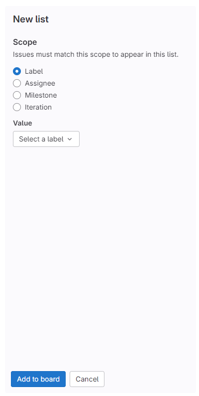

# Conclusion 

Throughout this learning module, we learned the basics of the Agile methodology including its history, pillars, principles and key components. We also compared Agile to the Waterfall traditional software development methodology to show the benefits of adopting Agile. The following is a summary of the key points regarding Agile:
- Agile is a software development methodology that revolves around taking incremental and iterative steps to create a software program.
- Developers will incrementally build their software projects using iteration that may vary in length and workload known as "Sprints".
- Agile emphasizes the importance of constant communication between the developers and the customers or stakeholders and encourages openness to changing requirements.
- Working software is the only measure of progress in Agile so developers should not spend copious amounts of time on estimation or unnecessary planning.
- User stories in Agile are high-level descriptions of a feature request or requirement written from the customer's perspective. 
- Epics are a collection of stories that form a longer cohesive user requirement.
- Tasks are technical todo item that are created from user stories and help developers organize their work. Larger tasks can be broken down into smaller subtasks.
- Spike are todo items that revolve around learning more about a framework or tool needed for a project and often precede tasks.
- Sync points are an opportunity for developers to get together and assess the bigger picture, evaluate their progress and update their workflow or requirements based on feedback.
- An Agile Board is a tool that helps developers keep track of their user stories and tasks and often contains several columns or containers including a Product Backlog, Sprint Backlog, an Icebox as well as status containers like Todo, In Progress, Awaiting Review and Done.
- User stories in Agile can have different priority levels with higher priority user stories taking the precedence in terms of implementation order.
- Agile projects of all sizes have higher success rates and lower challenge and failure rates compared to Waterfall projects of comparable sizes. 
- The Agile methodology is best suited for teams working on a single project at a time.

We also learned how to implement and use an Agile Board in GitHub Project and Microsoft Planner.

## GitLab

We did not cover creating an Agile Board using the GitLab "Issues Board"  tool because it does not provide enough flexibility to adopt the Agile methodology proposed in this learning module. Containers or lists in the GitLab "Issues Board" must have a set scope i.e., they must share the same label, assignee, milestone or iteration to appear in the same list. This limitation prevents from creating the containers (Product Backlog, Sprint Backlog, Todo, etc.) needed for our recommended Agile Board template and moving issues (user stories/tasks/spikes) through them. Thus, if you are starting a new project and you want to use the Agile methodology covered in this learning module, we recommend opting for GitHub over GitLab since GitHub Projects is much more suited for the creation of an Agile Board.

## References & Additional Resources
- [Manifesto for Agile Software Development](https://agilemanifesto.org/)
- [#NoEstimates (Allen Holub) - YouTube](https://www.youtube.com/watch?v=QVBlnCTu9Ms)
- [What Is Agile Methodology? (A Beginner’s Guide) • Asana](https://asana.com/resources/agile-methodology)
- [Agile Project Management: A Beginner's Guide | Adobe Workfront](https://business.adobe.com/blog/basics/agile)
- [Prioritizing User Stories in Agile Projects | by Alex Ponomarev | The Startup | Medium](https://medium.com/swlh/prioritizing-user-stories-in-agile-projects-d1dd8dd79165)
- [How to Use GitHub for Project Management | Zenhub Blog](https://blog.zenhub.com/how-to-use-github-agile-project-management/)
- [Learn how Git fits into an agile workflow | Atlassian](https://www.atlassian.com/agile/software-development/git)
- [Agile Project Success Rates are 2X Higher than Traditional Projects | by Anthony Mersino](https://medium.com/leadership-and-agility/agile-project-success-rates-are-2x-higher-than-traditional-projects-376a05e590d4)
- [Using GitHub as your Agile Project management platform (torre.me.uk)](https://torre.me.uk/2019/03/28/using-github-as-project-management-platform/)
- [The CHAOS Report 2015](https://www.standishgroup.com/sample_research_files/CHAOSReport2015-Final.pdf)
- [Can Scrum give its real value by running multiple projects in parallel with only one team?](https://mabrouk-thabet.medium.com/can-scrum-give-its-real-value-by-running-multiple-projects-in-parallel-with-only-one-team-f7ccda74e701)
- [How to manage working on multiple projects simultaneously? – The Agile Director](https://theagiledirector.com/article/2016/02/18/how-to-manage-working-on-multiple-projects-simultaneously/)

