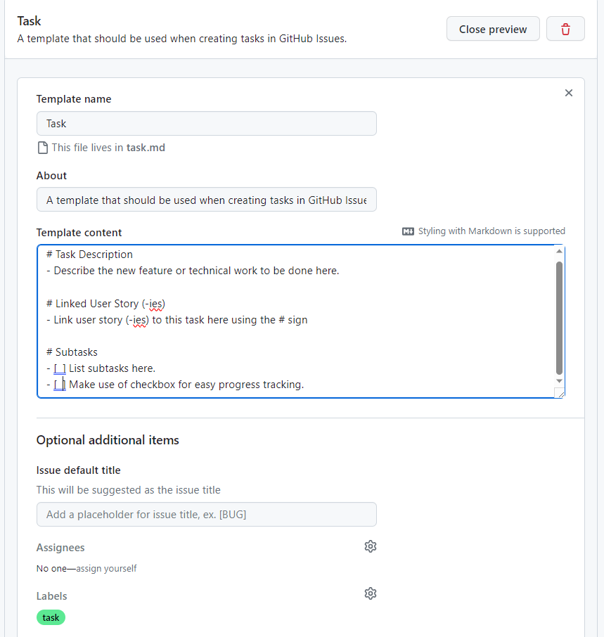
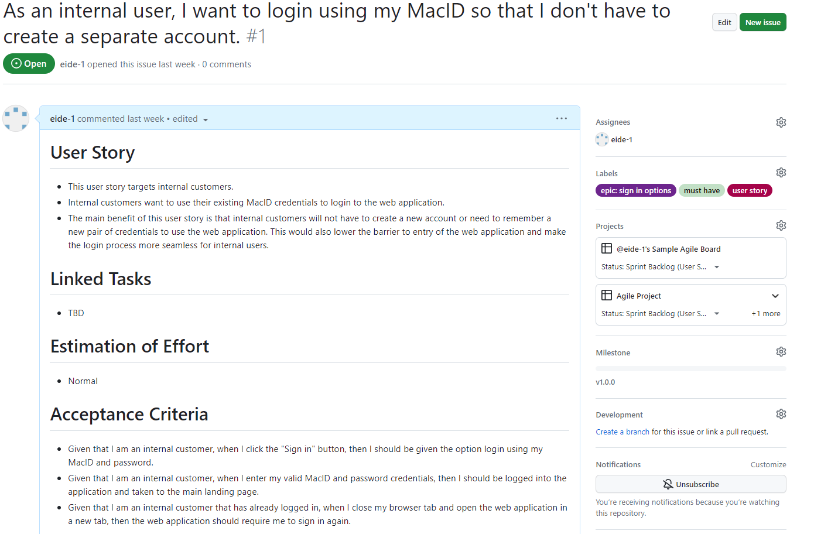
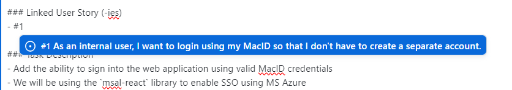

# Using GitHub Projects for Agile

GitHub is a repository management service that has taken over the development world over the past decade becoming the de facto place to host your software product. While GitHub revolutionized the way developers collaborate on code, it did not have a proper built-in project management tool until the introduction of **GitHub Projects** in 2021. Unlike traditional project management tools that are separate from the code repository, GitHub Projects integrates seamlessly with GitHub Issues and allows developers to easily keep track of their tasks and the overall progress of a software project. GitHub Projects enables teams to create an adaptable spreadsheet, task board and roadmap that incorporate existing issues and pull requests. GitHub Projects' was not designed with a specific methodology in mind, and provides a high degree of flexibility and customization. In this section of the learning module, we will learn how we can use GitHub Projects for Agile software development. We will learn how to create an Agile Board in GitHub Projects and how we can filter and group user stories in a spreadsheets. Lastly, we will lean how to plan iterations using the roadmap feature in GitHub Projects.

## Create Labels

We will start off by creating a "user story" label that will be used to tag issues that represent user stories in our repository.

Navigate to an existing GitHub repository or create a new one for the purposes of this learning module. 

Click the **Issues** button in the navigation bar 


Then click the **Labels** button in top right corner. 
 

Click the **New label** button to create a new label and fill out the fields as shown below:
- **Label name:** user story
- **Description:** A label that indicates that an issue is a valid user story
- **Color:** any color that is not already used for another label


Finally, click the **Create label** button to create the new label.

Repeat the steps above to create task label:
- **Label name:** task
- **Description:** A label that indicates that an issue is a task
- **Color:** any color that is not already used for another label


Repeat this process above and create 4 new labels detailed the different priority levels of the MoSCoW model as shown below:
- **Must Have**:
	- **Label name:** must have
	- **Description:** A label used on "Must Have" user stories
	- **Color:** any color that is not already used for another label
- **Should Have**:
	- **Label name:** should have
	- **Description:** A label used on "Should Have" user stories
	- **Color:** any color that is not already used for another label
- **Could Have**:
	- **Label name:** user story
	- **Description:** A label used on "Could Have" user stories
	- **Color:** any color that is not already used for another label
- **Won't Have**:
	- **Label name:** user story
	- **Description:** A label used on "Won't Have" user stories
	- **Color:** any color that is not already used for another label


## Create Milestone

We will now add a milestone to our project to represent the first sync point.

Navigate to an existing GitHub repository or create a new one for the purposes of this learning module. 

Click the **Issues** button in the navigation bar 


Then click the **Milestones** button in top right corner. 

Click the **New milestone** button to create a new label and fill out the fields as shown below:
- **Title:** v1.0.0
- **Due date:** leave blank for now
- **Description:** The first milestone in this project representing the first stable release.

Finally, click **Create milestone**.
## Create Templates

We will now create an issue template that we will use for the issues that represent user stories in our repository.

Click the **Settings** button in the navigation bar to view your repository settings. Scroll down and click the **Set up templates** button under **Issues**.


Click **Add template** and then select **Custom Template** from the dropdown menu. 


Next, click **Preview and edit** button adjacent to the custom template you just created.


Click the **pencil icon** next to the title of your template to edit its fields.


Fill out the fields as shown below:
- **Template name:** User Story
- **About:** A template that should be used when creating user stories in GitHub Issues.
- **Description:**

```
# User Story
- Provide a high-level detailed description of the user story from the perspective of the customer. Do not include implementation details in this section. Describe the feature, its behavior and the goal that it will help the user achieve.
- Answer the following questions:
  - Who are we building this for?
  - What are they trying to achieve?
  - What’s the overall benefit they’re trying to achieve? How does it fit into the bigger picture?
- You can use the following format for user stories: "As a <type of user>, I want to <perform some task> so that I can <achieve some goal>."

# Linked Tasks
- Enter linked tasks here using the # sign

# Estimation of Effort
- Provide an estimate of the amount of work that this user story will require to be completely and successfully implemented using the following estimation scale:
  - Not Specified
  - Trivial
  - Easy
  - Normal
  - Hard
- Try to avoid overthinking this process or spending too much time on estimation.
- The default option is "Not Specified" and you can leave it as such.

# Acceptance Criteria
- Describe the conditions that the software product must satisfy to be accepted by a user, customer or other stakeholder.
- The acceptance criteria should be testable and act as testing guidelines for developers.
- Acceptance criteria should use the following format: "Given (how things begin), when (action taken), then (outcome of taking action)."	
```

- **Labels:** user story

Click the **Close preview** button after entering the required information.

Finally, click **Propose changes** and the click **Commit changes** to save the new user story template. 


Repeat the process outlined above to create the task template with the following information:
- **Template name:** Task
- **About:** A template that should be used when creating tasks in GitHub Issues.
- **Description:**
```
# Task Description
- Describe the new feature here.  

# Linked User Story (-ies)
- Link user story (-ies) to this task here

# Subtasks
- List subtasks here. 

```
- **Label:** task



## Create Pull Request Templates

We will now create the templates for feature pull requests and bug fix pull requests:

1. Navigate to the **Code** tab of your GitHub repository
2. Click the **Add file** button and select **Create new file**
3. Enter `.github/PULL_REQUEST_TEMPLATE/feature_pr_template.md` in the name field
4. Add the following content to the file 
```
# Feature Title

### Feature Description
Describe the new feature here.  

### Expected Behavior
Describe the expected behavior here.  

### Test Cases
Detail the test cases you used.  

### Additional Information
Describe the addition changes/steps you took, for example the SQL commands used for adding a column in database table.  

```
5. Click commit changes to the save the file.

Repeat the process above to create the bug fix pull request template using the following information:
**File name:** `.github/PULL_REQUEST_TEMPLATE/bugfix_pr_template.md`
**File content:**
```
# Bug Fix Title

### Issue Description
Describe the issue here.  

### Steps to Reproduce
Provide a step-by-step guide to reproducing the issue.

### Expected Behavior
Describe the expected behavior here.  

### Solution/Fix Description
Describe what approaches are taken to fix/mitigate the issue.  

### Test Cases
Detail the test cases you used.  

### Additional Information
Describe the addition changes/steps you took, for example the SQL commands used for adding a column in database table.  

```

When creating a pull request, add the following query parameter to the URL to use one of the templates above:
- `template=feature_pr_template.md`
- `template=bugfix_pr_template.md`
## Create a New Project

Now that we created the user story label and template, we can proceed to create a new project in GitHub Projects.

Click the **Projects** button in the navigation bar of your repository, then click the downwards-facing arrow next to **Link a project** and select **New project** from the dropdown menu. The **Link a project** button will change to **New project**. Click the **New project** button.


In the pop window, select **Board** from the left pane. Enter a **name** for your project and then click **Create**.


Your project board is now created. Make sure to rename **View 1** to **Board**.

Default Name           |  Updated Name
:-------------------------:|:-------------------------:
  |  

The default board in GitHub Projects will have three containers: Todo, In Progress and Done.


## Add New Containers

As described in the previous section, an Agile Board should have 7 containers: Product Backlog, Sprint Backlog, Icebox, Todo, In Progress, Awaiting Review, Done.

Click the **+** button next to the Done container to create a new container. 


Next, click **New Column** an fill the form in the popup window. We will start by creating the **Product Backlog** container. You may want to include the kind of items that belong in each container in parentheses after the container name to help team members distinguish the different containers.


You can modify an existing containers by clicking the **three ellipses** next in the top right corner of a container and then selecting **Edit details** from the dropdown menu.


Repeat the process outline for each one of the seven containers and enter the information below:

- **Product Backlog**
	- Label text: Product Backlog (User Stories)
	- Color: Red
	- Description: Contains user stories that have not been assigned to a sprint backlog.
- **Sprint Backlog**
	- Label text: Sprint Backlog (User Stories)
	- Color: Orange
	- Description: Contains user stories that are part of the current sprint.
- **Todo**
	- Label text: Todo (Tasks or Spikes)
	- Color: Green
	- Description: These tasks haven't been started.
- **In Progress**
	- Label text: In Progress (Tasks or Spikes)
	- Color: Yellow
	- Description: These tasks are actively being worked on.
- **Awaiting Review**
	- Label text: Awaiting Review (Tasks or Spikes)
	- Color: Pink
	- Description: These tasks are complete but have yet to be reviewed.
- **Done**
	- Label text: Done (Tasks or Spikes)
	- Color: Purple
	- Description: These tasks have been completed.
- **Icebox**
	- Label text: Icebox (Tasks or Spikes)
	- Color: Blue
	- Description: Contains "frozen" user stories that may or may not be addressed in the future.

You can click on a container and drag it to rearrange the order of the containers. Your final Agile Board should look something like this:


## Add Roadmap

Now that our board is ready, we will create an alternate view in GitHub Projects for our roadmap. 
Click the **New View** button next to the **Board** tab and select **Roadmap** from the dropdown menu.


Rename the new view to **Roadmap**. Next, click on the **Date fields** button in the top right corner of the new view and select **New field**. Enter **Iteration** in the Field name box and select **Iteration** as the Field type. Select the date on which your iteration should start and its duration in weeks. Finally, click on **Save and create**.


You will now need to select the date fields by clicking on **Date fields** and selecting **Iteration Start** and **Iteration End** for the Start date and target Date respectively and clicking on **Save**. 


## Add Table

We will now create our final view which contains a spreadsheet-like table. Click the **New View** button next to the **Board** tab and select **Table** from the dropdown menu.

Rename the new view to **Table**. Click the **+** button next to the **Status** column and check **Labels**, **Milestone** and **Iteration** to display these hidden fields and click **Save**.


You can show or hide fields in the future as needed.

## Save the Project as a Template

Now that we completed our GitHub Project setup, we will save it as a template so that we can reuse it in future projects. 

Open the project settings page by clicking on the the three ellipses in the top right corner and select **Settings** from the dropdown menu.


Under the **Templates** category, click on the **Copy as template** button. 

In the popup window, select the **Owner**, enter a **Project name** and then click on **Copy as template**.


Your template is now saved as its own project. Do not use this template project as a real project. Leave it at this stage, so that you can always copy it and use that copy as a starting point for future projects.

## Create an Example User Story

Now that our template is ready, we will explain how we can use it according to the proposed Agile workflow we devised in the previous section.

After meeting with your client(s) and/or stakeholder(s) and gathering your user stories and epics, you will need to enter the collected user stories into GitHub as issues using the the template we created earlier.

You can create new issues in one of two ways:
1. Navigate to the **Issues** tab of your GitHub repository and click the **New Issue**, then click the **Get started** button adjacent to the **User Story** template.
	

2. From the Agile Board, click the **Add Item** button at the bottom of  the **Product Backlog** container, then enter a **pound sign** (**#**) and select your GitHub repository. You will be presented with a **Create new issue** option, click that button and new popup will open. Click the **Choose** button adjacent to the **User Story** template.
	
	

We will now create an example user story. For the purposes of this learning module, we will create a user story centered around adding single sign-on using MacID credentials. 

The title of the user story follow the format proposed in the previous section: "# As an internal user, I want to login using my MacID so that I don't have to create a separate account."

Next, fill out the body of the user story. The text provided below is an example of the information to include in this section:

```
# User Story
- This user story targets internal customers.
- Internal customers want to use their existing MacID credentials to login to the web application.
- The main benefit of this user story is that internal customers will not have to create a new account or need to remember a new pair of credentials to use the web application. This would also lower the barrier to entry of the web application and make the login process more seamless for internal users.

# Linked Tasks
- TBD

# Estimation of Effort
- Normal

# Acceptance Criteria
- Given that I am an internal customer, when I click the "Sign in" button, then I should be given the option login using my MacID and password.
- Given that I am an internal customer, when I enter my valid MacID and password credentials, then I should be logged into the application and taken to the main landing page.
- Given that I am an internal customer that has already logged in, when I close my browser tab and open the web application in a new tab, then the web application should require me to sign in again.
```

In the "User Story" section, we answered the primary questions outlined in the user story template, we also included a basic estimation of effort as well as the acceptance criteria. 

Make sure to add the "user story" label to this issue. Furthermore, given that this user story relates directly to the security of our web application and since we cannot ship a web application that does not meet the minimum security requirements, we classified this user story as a "Must Have" as shown by the label. 

This user story represents a feature that should be part of the first stable release, click on **Milestone** in the right side bar and select **v1.0.0**.

Our user story is part of a bigger epic that centers around giving customers multiple sign in options to accommodate both internal and external users. The epic is defined in an external Word document as shown below:


We will now create a label for this particular epic. We recommend using the same color for all epic label and keeping their names relatively short. We also encourage developers to use the following naming convention for epic labels: `epic: <title>`.

To create additional labels from the user story page, click the **gear icon** on the right and then select **Edit labels** from the dropdown menu, then click **New label** and fill out the name, description and color fields.


We entered the following information for our epic:
- **Label name:** epic: sign in options
- **Description:** Give users multiple sign-in options
- **Color:** \#6D258D

Click **Create label** after entering the label information.

Finally, go back to the user story and the newly created epic label.



## Add Another User Story

Repeat the steps above and create another user story that centers around giving external users the ability to sign into the web application using their Google account.

We recommend using the following title: "As an external user, I want to login using my Google account so that I don't have to create a new account".

Add the following description to the body of the user story:
```
# User Story
- This user story targets external customers.
- External customers want to use their existing Google account credentials to login to the web application.
- The main benefit of this user story is that external customers will not have to create a new account or need to remember a new pair of credentials to use the web application. This would also lower the barrier to entry of the web application and make the login process more seamless for external users.

# Linked Tasks
- TBD

# Estimation of Effort
- Normal

# Acceptance Criteria
- Given that I am an external customer, when I click the "Sign in" button, then I should be given the option login using my Google account.
- Given that I am an external customer, when I enter my valid Google account and password credentials, then I should be logged into the application and taken to the main landing page.
- Given that I am an external customer that has already logged in, when I close my browser tab and open the web application in a new tab, then the web application should require me to sign in again.
```

Make sure to tag the user story with the "user story", "must have" and "epic: sign in options" labels and the v1.0.0 milestone.


## Add User Stories to Agile Board

Open your GitHub Project and click **Add item** button at the bottom of the Product Backlog container. Next, enter a **pound sign** (**#**) and select your GitHub repository and select the two user stories we just created from the menu.


Your Product Backlog container will now look like this:


# Populate Sprint Backlog

When you are ready to start development on your project, you will need to select a set of user stories to work on in the first sprint. Starting with high priority (i.e., "Must Have") user stories is often recommended, but you should also consider the dependencies between the different user stories. For example, if completing a user story is a blocker for a set of other user stories, then it may be beneficial to complete that user story first, so that you can address the other dependent user stories in future sprints. If during this assessment process, you encounter issues that you want to freeze, make sure to move them to the Icebox container on the Agile Board.

Our current product backlog is very simple, so we will start off by moving the MacID single sign-on user story to the spring backlog container by dragging it to the proper container. 


You can click on a user story in your sprint backlog and assign a developer and an iteration (i.e. sprint) to it.


## Create Tasks/Subtasks from User Stories

Developers should create tasks and/or subtasks for each user story in the current sprint backlog. Tasks can then be converted into an issue and subsequently a pull request that will reviewed and merged once ready. Note that not every task or subtask needs to be turned into an issue. You can usually a single comprehensive task that gets converted an issue an then a merge request and several associated subtasks. We will now detail the process of splitting our MacID single sign-on user story into tasks and subtasks as an example.

Click the **Add item** button at the bottom of the **Todo** container and add the following task (without selecting a repository using the # sign): "Add MacID SSO using MS Azure and the msal-react library".
Notice that tasks can use technical lingo and do not need to be written from the customer's perspective. 


We will now convert our primary task into an issue by hovering on the task card, clicking the ellipses button and selecting **Convert to issue** from the dropdown menu and finally selecting the appropriate repository.


Next, click on the task card in the container and assign a developer to it as well as an iteration.
Click the **Edit** button and enter **/** (forward slash) in the text box that appears.

Select Templates from the dropdown menu


Select Task from the dropdown menu to load in the task template.


Update the task body with the following information:
```
# Linked User Story (-ies)
- #1 

# Task Description
- Add the ability to sign into the web application using valid MacID credentials
- We will be using the `msal-react` library to enable SSO using MS Azure

# Subtaks
- Register SPA in MS Azure AD
- Create environment and authentication configuration files
- Wrap template in `MsalProvider` component
- Create `SignInButton` and `SignOutButton` components
- Create `PermissionGate` component to check if a user is signed in or not
- Create the Microsoft Graph client helper
- Update existing pages to be restricted unless a user is logged in

```

Notice that we linked a user story by entering a **pound sign** (**#**) and then selecting the user story from the dropdown menu. The user story number may be different for you.



Make sure to tag the issue with the **task** label we created earlier.

Remember to go back to the user story and update the **Linked Tasks** section as shown below:


## Move Tasks through Containers

Once a developer starts working on a task, they will create a branch with the desired changes.

The task should be moved through the containers according to the following progression track:
1. When the developer starts working on a task, they should move its card to the **In Progress** container.
	
2. When the developer is done working on a task, they should create a pull request:
	1. Go to the **Pull Request** tab on their repository, clicking on **New pull request**.
	2. Select the source branch
	3. Add `?template=feature_pr_template.md` or `?template=bugfix_pr_template.md` to the URL
	4. Click **Create pull request**
	5. Fill out the **Title** and the **Body** of the pull request
	6. Click **Create Pull Request**
3. Link the pull request to the task by opening the pull request clicking on **Development** in the side bar and selecting the task.
	
4. Add **Reviewers** and **Assignees** to the pull request
5. Move the task card to the **Awaiting Review** container
	
6. When the pull request has been tested and approved, the task card should be moved to the **Done** container and the developer in charge of this task should also close it (i.e., close the issue in GitHub).
	
7. Once all the tasks that are part of a user story are done, the user story issue should also be closed.

## Using the Roadmap View

The Roadmap view allows you to view the user stories and tasks that are part of the current iteration in a calendar view.


## Using the Table View

The Table view functions like a spreadsheet and allows to search for particular user stories and tasks or filter according to different attributes like the current status, label, milestone, etc.

You can add or remove fields from the table view using the **+** button in top right corner of the table. 


Additionally, you can use the search box above the table to find particular user stories or tasks. For instance, the query below returns all the "Must Have" user stories that in the Product Backlog.


## Wrapping Up an Iteration

An iteration is complete after its assigned duration has elapsed and all the user stories in the Sprint Backlog are closed. Note that you can close a user story by clicking on it and then clicking on the **Close Issue** button. Make sure that **Close as completed** is selected from the dropdown menu.


At the end of an iteration, the team should meet to assess the work done during the current iteration. Ideally, all user stories in the current Sprint Backlog should be completed at this point. Nevertheless, if the team is left with incomplete user stories in the Sprint Backlog, then can be addressed in the following sprint or moved back to the Product Backlog or Icebox if the user requirements have changed.

The meeting at the end of an iteration is also a great opportunity for the team to assess their progress on a project and identify any weak points and modify their methodology or strategy accordingly. 


