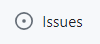

# Using GitHub Projects for Agile

GitHub is a repository management service that has taken over the development world over the past decade becoming the de facto place to host your software product. While GitHub revolutionized the way developers collaborate on code, it did not have a proper built-in project management tool until the introduction of **GitHub Projects** in 2021. Unlike traditional project management tools that are separate from the code repository, GitHub Projects integrates seamlessly with GitHub Issues and allows developers to easily keep track of their tasks and the overall progress of a software project. GitHub Projects enables teams to create an adaptable spreadsheet, task board and roadmap that incorporate existing issues and pull requests. GitHub Projects' was not designed with a specific methodology in mind, and provides a high degree of flexibility and customization. In this section of the learning module, we will learn how we can use GitHub Projects for Agile software development. We will learn how to create an Agile Board in GitHub Projects and how we can filter and group user stories in a spreadsheets. Lastly, we will lean how to plan iterations using the roadmap feature in GitHub Projects.

## "user story" Label

We will start off by creating a "user story" label that will be used to tag issues that represent user stories in our repository.

Navigate to an existing GitHub repository or create a new one for the purposes of this learning module. 

Click the **Issues** button in the navigation bar 


Then click the **Labels** button in top right corner. 
 

Click the **New Label** button to create a new label and fill out the fields as shown below:
- **Label name:** user story
- **Description:** A label that indicates that an issue is a valid user story
- **Color:** any color that is not already used for another label


Finally, click the **Create label** button to create the new label.
## User Stories Template

We will now create an issue template that we will use for the issues that represent user stories in our repository.

Click the **Settings** button in the navigation bar to view your repository settings. Scroll down and click the **Set up templates** button under **Issues**.


Click **Add template** and then select **Custom Template** from the dropdown menu. 


Next, click **Preview and edit** button adjacent to the custom template you just created.


Click the **pencil icon** next to the title of your template to edit its fields.


Fill out the fields as shown below:
- **Template name:** User Story
- **About:** A template that should be used when creating user stories in GitHub Issues.
- **Description:**
```
# User Story
- Provide a high-level detailed description of the user story from the perspective of the customer. Do not include implementation details in this section. Describe the feature, its behavior and the goal that it will help the user achieve.
- Answer the following questions:
  - Who are we building this for?
  - What are they trying to achieve?
  - What’s the overall benefit they’re trying to achieve? How does it fit into the bigger picture?
- You can use the following format for user stories: "As a <type of user>, I want to <perform some task> so that I can <achieve some goal>."

# Estimation of Effort
- Provide an estimate of the amount of work that this user story will require to be completely and successfully implemented using the following estimation scale:
  - Not Specified
  - Trivial
  - Easy
  - Normal
  - Hard
- Try to avoid overthinking this process or spending too much time on estimation.
- The default option is "Not Specified" and you can leave it as such.

# Acceptance Criteria
- Describe the conditions that the software product must satisfy to be accepted by a user, customer or other stakeholder.
- The acceptance criteria should be testable and act as testing guidelines for developers.
- Acceptance criteria should use the following format: "Given (how things begin), when (action taken), then (outcome of taking action)."	
```
- **Labels:** user story

Click the **Close preview** button after entering the required information.

Finally, click **Propose changes** and the click **Commit changes** to save the new user story template. 


## Create a New Project

Now that we created the user story label and template, we can proceed to create a new project in GitHub Projects.

Click the **Projects** button in the navigation bar of your repository, then click the downwards-facing arrow next to **Link a project** and select **New project** from the dropdown menu. The **Link a project** button will change to **New project**. Click the **New project** button.


In the pop window, select **Board** from the left pane. Enter a **name** for your project and then click **Create**.


Your project board is now created. Make sure to rename **View 1** to **Board**.

Default Name           |  Updated Name
:-------------------------:|:-------------------------:
  |  

The default board in GitHub Projects will have three containers: Todo, In Progress and Done.


## Add New Containers

As described in the previous section, an Agile Board should have 7 containers: Product Backlog, Sprint Backlog, Icebox, Todo, In Progress, Awaiting Review, Done.

Click the **+** button next to the Done container to create a new container. 


Next, click **New Column** an fill the form in the popup window. We will start by creating the **Product Backlog** container. You may want to include the kind of items that belong in each container in parentheses after the container name to help team members distinguish the different containers.


You can modify an existing containers by clicking the **three ellipses** next in the top right corner of a container and then selecting **Edit details** from the dropdown menu.


Repeat the process outline for each one of the seven containers and enter the information below:

- **Product Backlog**
	- Label text: Product Backlog (User Stories)
	- Color: Red
	- Description: Contains user stories that have not been assigned to a sprint backlog.
- **Sprint Backlog**
	- Label text: Sprint Backlog (User Stories)
	- Color: Orange
	- Description: Contains user stories that are part of the current sprint.
- **Todo**
	- Label text: Todo (Tasks or Spikes)
	- Color: Green
	- Description: These tasks haven't been started.
- **In Progress**
	- Label text: In Progress (Tasks or Spikes)
	- Color: Yellow
	- Description: These tasks are actively being worked on.
- **Awaiting Review**
	- Label text: Awaiting Review (Tasks or Spikes)
	- Color: Pink
	- Description: These tasks are complete but have yet to be reviewed.
- **Done**
	- Label text: Done (Tasks or Spikes)
	- Color: Purple
	- Description: These tasks have been completed.
- **Icebox**
	- Label text: Icebox (Tasks or Spikes)
	- Color: Blue
	- Description: Contains "frozen" user stories that may or may not be addressed in the future.

You can click on a container and drag it to rearrange the order of the containers. Your final Agile Board should look something like this:


## Add Roadmap

Now that our board is ready, we will create an alternate view in GitHub Projects for our roadmap. 
Click the **New View** button next to the **Board** tab and select **Roadmap** from the dropdown menu.


Rename the new view to **Roadmap**. Next, click on the **Date fields** button in the top right corner of the new view and select **New field**. Enter **Iteration** in the Field name box and select **Iteration** as the Field type. Select the date on which your iteration should start and its duration in weeks. Finally, click on **Save and create**.


## Add Table

We will now create our final view which contains a spreadsheet-like table. Click the **New View** button next to the **Board** tab and select **Table** from the dropdown menu.

Rename the new view to **Table**. Click the **+** button next to the **Status** column and check **Labels**, **Milestone** and **Iteration** to display these hidden fields.


You can show or hide fields in the future as needed.

## Save the Project as a Template

Now that we completed our GitHub Project setup, we will save it as a template so that we can reuse it in future projects. 

Open the project settings page by clicking on the the three ellipses in the top right corner and select **Settings** from the dropdown menu.


Under the **Templates** category, click on the **Copy as template** button. 

In the popup window, select the **Owner**, enter a **Project name** and then click on **Copy as template**.


Your template is now saved as its own project. Do not use this template project as a real project. Leave it at this stage, so that you can always copy it and use that copy as a starting point for future projects.