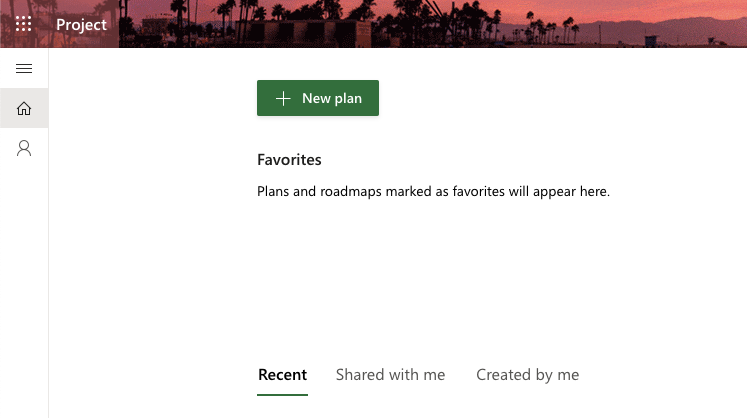

# Using Microsoft Project for the Web for Agile

Project for the Web (P4tW) is another web-based project management tool from Microsoft. It aimed at teams needing advanced project management capabilities and offers a more powerful work management features than Microsoft Planner. Since it is built on the Microsoft Power Platform, which includes tools and packages like, Power BI and the Microsoft Dataverse, it offers deeper integration with other Microsoft services and more customization options.  

## Create a Project

1. Start by opening the web client by navigating to [project.microsoft.com](https://project.microsoft.com/)
2. Click on **New plan** in the main view. 

	
3. Select **Blank plan**.

## Add New Buckets

Once we have a new project, select the Board view next to the project name and we will add two buckets (User Stories & Tasks) to the board. These buckets will used to identify whether a task item in P4tW is a task or a user story.  

## Task Attributes

Before we add new tasks item to the agile board, let's first look at some of the attributes in a P4tW task.  

- **Name**: the title given to a task, providing a brief and clear indication of what the task is about. 
- **Priority**: the level of importance assigned to a task, categorized as urgent, important, medium or low, to help determine the order in which tasks should be addressed. 
- **Assignment (i.e. Assigned to)**: the team member(s) responsible for completing the task. 
- **Bucket**: grouping tasks to identify whether an item is a task or a user story. 
- **Sprint**: period during which the task are expected to be completed and reviewed. 
- **Checklist**: list of spikes that need to be completed as part of the task. 
- **Dependency**: for tasks that are categorized in the user stories bucket, each contains a list of tasks that need to be completed. 

### Create Custom Fields (Optional)

Project for the Web provides the capability to add custom attributes to tasks, enabling more tailored and efficient task management. Start by selecting the Grid view. Scroll to the right most of the grid and click "Add column".  

We suggested adding two custom multiple choice type fields **Components** and **Status**. The componenet field helps to link the task to a specific part of the product and the status field helps to track the progression of the task.  

    
    

 

## Start a Sprint

To start a sprint in Project for the Web, begin by navigating to the Board view of your project. Once you're in the Board view, select the option to group tasks by Sprint. This grouping helps you organize tasks within specific sprints, making it easier to track progress and manage workload.  

Next, set up your sprint by renaming the default sprint and setting the start and end dates. If you need additional sprints, you can create new ones by selecting "+ Add new sprint" and specifying their dates. Note that the start and end dates of a sprint cannot overlap with the dates of other sprints. This step ensures that each sprint has a clear timeframe and objectives.  

After setting up your sprints, add tasks as well as the relate user stories to them. You can either create new task items directly within the sprint or move existing items from the backlog into the sprint by dragging and dropping them. This flexibility allows you to prioritize and allocate task items based on the sprint’s goals. We suggested that if tasks in a user story are not fully completed by the end of the sprint, the user story and overdue tasks should be moved, not duplicated, to the new sprint for simplicity.  

Finally, use the Board view to manage and track the progress of tasks within the sprint. You can update task details, move tasks between columns to reflect their status, and monitor the overall progress of the sprint. This view provides a comprehensive overview of your sprint, helping you stay on top of deadlines and deliverables.  

### Sprint Meetings

Scrum, an agile team collaboration framework, recommends holding meetings for sprint planning and sprint review (also known as sprint retrospective). However, Project for the Web does not offer functionality to record these meetings. We recommend documenting these Scrum meetings using other tools, such as Microsoft Word or OneNote. Information, such as status and plans for the outstanding user stories and taskes, should be documented. 
