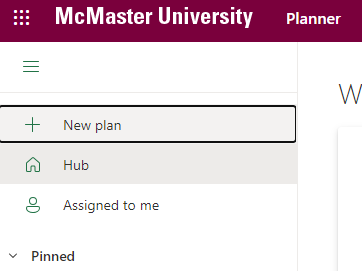
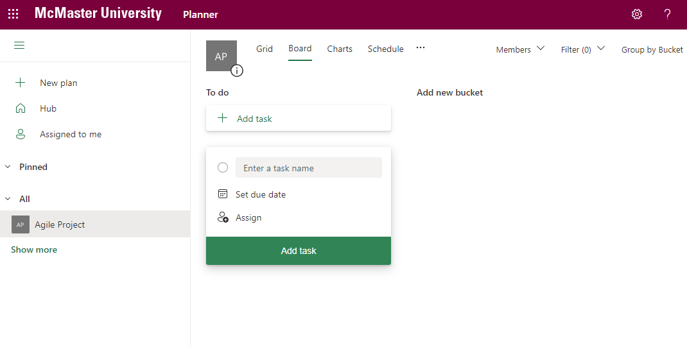
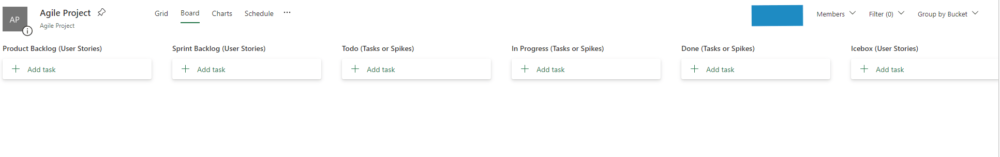
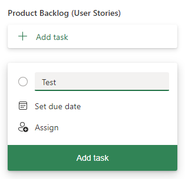
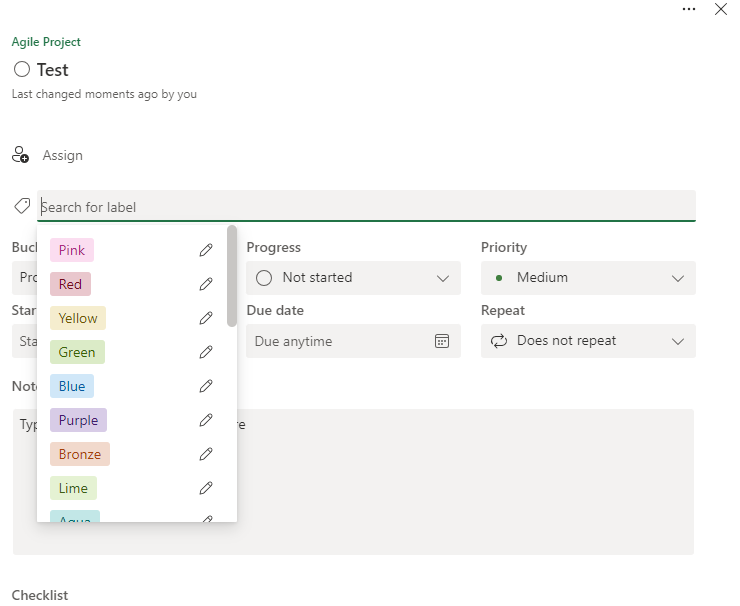
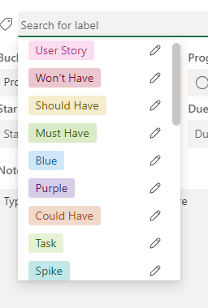
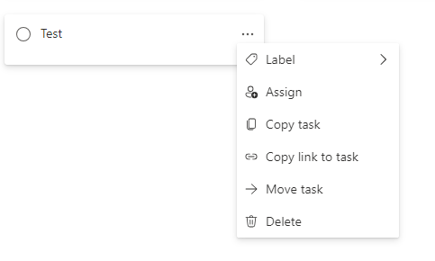
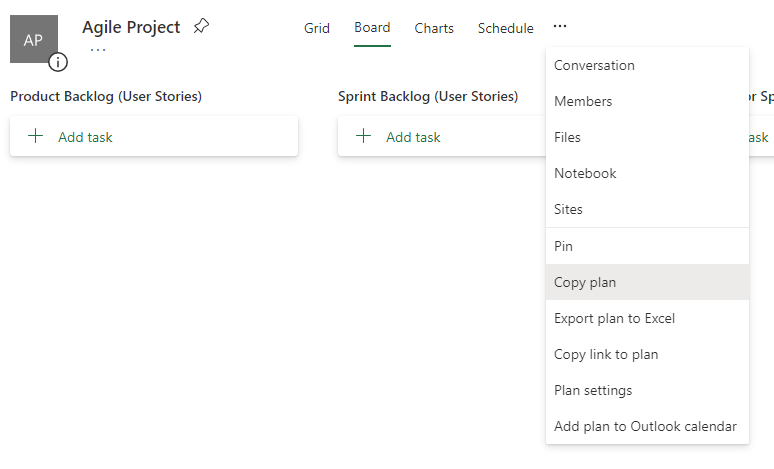
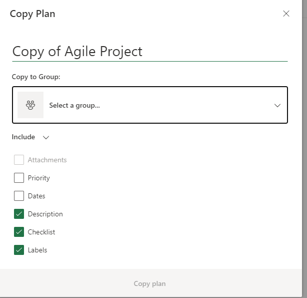

# Using Microsoft Planner for Agile

Microsoft Planner is a web-based project management tool that enables teams to create, organize and assign tasks and to-do lists using a simple Kanban-like interface. Microsoft Planner integrates seamlessly with other Microsoft 365 product, and as such can be the go-to product management tool for teams that rely on the Microsoft ecosystem of office software products. On the other hand, Microsoft Planner does not integrate with existing repository management services like GitHub or GitLab without the use of paid third-party tools. In this section, we will learn how to create and manage an Agile Board for a software project using Microsoft Planner.

## Create a New Plan

1. Start by opening the web client by navigating to [tasks.office.com](https://tasks.office.com/)

2. Click on **New plan** in the sidebar. 

	

3. Select **New Blank Plan**.
4. Enter a **Plan Title** (e.g., Agile Board) and specify if your project should be **Private** or **Public** from the **Privacy and Sensitivity** dropdown menu.
5. Click **Create** and you will be taken to the new board that should similar to the one shown below.

## Create Buckets

Akin to GitHub Projects, Microsoft Planner allows you to add containers or buckets that house a set of tasks. We will now add the Agile containers we discussed earlier.

1. Rename the **To do** bucket to **Todo (Tasks or Spikes)** by clicking on the title.
2. Click **Add new bucket** and enter **Product Backlog (User Stories)**
3. Repeat step 2 to create the **Sprint Backlog (User Stories)**, **Icebox (User Stories)**, **In Progress (Tasks or Spikes)**, **Awaiting Review (Tasks or Spikes)**, and **Done (Tasks or Spikes)** buckets.
4. Rearrange the buckets by clicking on one and dragging it so that they end up in the following order: Product Backlog &rarr; Sprint Backlog &rarr; Todo &rarr; In Progress &rarr; Awaiting Review &rarr; Done &rarr; Icebox.

You Agile Board should now look like this:

## Add Labels

We will now add all the labels needed for our Agile Board.

1. Create a **Test** task under the **Product Backlog** bucket by clicking the the **Add task** button.
2. Enter **Test** in **name** field and click the **Add task** button.

	

3. Once the task in the Product Backlog, click on it to bring up the edit panel. 
4. From the edit panel, you can click on **Add label** to modify the default labels

	

5. Modify each label by clicking on the **pencil icon** next to it. You will need to select a distinct color for each one of the following labels: User Story, Task, Spike, Must Have, Should Have, Could Have, Won't Have. We recommend the following color scheme, but feel free to modify it as you see fit:

	

6. Delete the Test task after updating the labels by clicking on the **three dots** in the task card and selecting **Delete** from the dropdown menu.

	

## Copy Template

Our template for the Agile Board is now ready. You should not use this plan for actual project. Instead leave it as template that can be copied for use in future project.

To copy the template:

1. Open the **Agile Board** plan
2. Click the **three dots** next to Schedule

	

3. Select **Copy plan** from the dropdown menu
4. Select the **Group** you want to copy to
5. Select the items to include in the copy. Make sure that **Labels** is checked. 
6. Click **Copy Plan**

	

## Add User Stories

## Add Tasks

