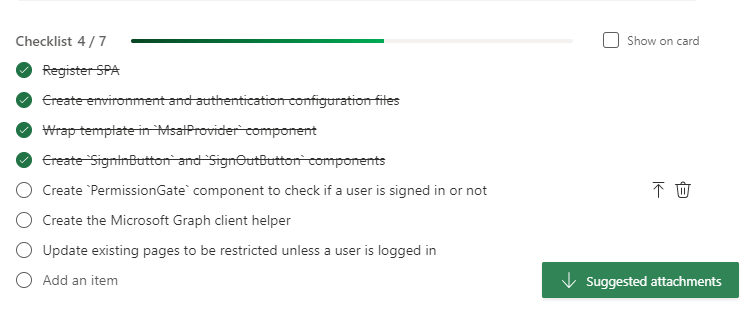

# Using Microsoft Planner for Agile

Microsoft Planner is a web-based project management tool that enables teams to create, organize and assign tasks and to-do lists using a simple Kanban-like interface. Microsoft Planner integrates seamlessly with other Microsoft 365 product, and as such can be the go-to product management tool for teams that rely on the Microsoft ecosystem of office software products. On the other hand, Microsoft Planner does not integrate with existing repository management services like GitHub or GitLab without the use of paid third-party tools. In this section, we will learn how to create and manage an Agile Board for a software project using Microsoft Planner.

## Create a New Plan

1. Start by opening the web client by navigating to [tasks.office.com](https://tasks.office.com/)

2. Click on **New plan** in the sidebar. 

	

3. Select **New Blank Plan**.
4. Enter a **Plan Title** (e.g., Agile Board) and specify if your project should be **Private** or **Public** from the **Privacy and Sensitivity** dropdown menu.
5. Click **Create** and you will be taken to the new board that should similar to the one shown below.


## Create Buckets

Akin to GitHub Projects, Microsoft Planner allows you to add containers or buckets that house a set of tasks. We will now add the Agile containers we discussed earlier.

1. Rename the **To do** bucket to **Todo (Tasks or Spikes)** by clicking on the title.
2. Click **Add new bucket** and enter **Product Backlog (User Stories)**
3. Repeat step 2 to create the **Sprint Backlog (User Stories)**, **Icebox (User Stories)**, **In Progress (Tasks or Spikes)**, **Awaiting Review (Tasks or Spikes)**, and **Done (Tasks or Spikes)** buckets.
4. Rearrange the buckets by clicking on one and dragging it so that they end up in the following order: Product Backlog &rarr; Sprint Backlog &rarr; Todo &rarr; In Progress &rarr; Awaiting Review &rarr; Done &rarr; Icebox.

You Agile Board should now look like this:


## Add Labels

We will now add all the labels needed for our Agile Board.

1. Create a **Test** task under the **Product Backlog** bucket by clicking the the **Add task** button.
2. Enter **Test** in **name** field and click the **Add task** button.

	

3. Once the task in the Product Backlog, click on it to bring up the edit panel. 
4. From the edit panel, you can click on **Add label** to modify the default labels

	

5. Modify each label by clicking on the **pencil icon** next to it. You will need to select a distinct color for each one of the following labels: User Story, Task, Spike, Must Have, Should Have, Could Have, Won't Have. We recommend the following color scheme, but feel free to modify it as you see fit:

	

6. Delete the Test task after updating the labels by clicking on the **three dots** in the task card and selecting **Delete** from the dropdown menu.

	

## Copy Template

Our template for the Agile Board is now ready. You should not use this plan for actual project. Instead leave it as template that can be copied for use in future project.

To copy the template:

1. Open the **Agile Board** plan
2. Click the **three dots** next to Schedule

	

3. Select **Copy plan** from the dropdown menu
4. Select the **Group** you want to copy to
5. Select the items to include in the copy. Make sure that **Labels** is checked. 
6. Click **Copy Plan**

	

## Add User Stories

In your project's Agile Board, add user stories to the Product Backlog bucket by clicking on **Add task** and then entering the title of the user story. The title should use the following format: "As a \<type of user>, I want to \<perform some task> so that I can \<achieve some goal>."

We recommend that you fill out the body of the user story using the following template:

```
# User Story
- Provide a high-level detailed description of the user story from the perspective of the customer. Do not include implementation details in this section. Describe the feature, its behavior and the goal that it will help the user achieve.
- Answer the following questions:
  - Who are we building this for?
  - What are they trying to achieve?
  - What’s the overall benefit they’re trying to achieve? How does it fit into the bigger picture?
- You can use the following format for user stories: "As a <type of user>, I want to <perform some task> so that I can <achieve some goal>."

# Linked Tasks
- Enter linked tasks here using the # sign

# Estimation of Effort
- Provide an estimate of the amount of work that this user story will require to be completely and successfully implemented using the following estimation scale:
  - Not Specified
  - Trivial
  - Easy
  - Normal
  - Hard
- Try to avoid overthinking this process or spending too much time on estimation.
- The default option is "Not Specified" and you can leave it as such.

# Acceptance Criteria
- Describe the conditions that the software product must satisfy to be accepted by a user, customer or other stakeholder.
- The acceptance criteria should be testable and act as testing guidelines for developers.
- Acceptance criteria should use the following format: "Given (how things begin), when (action taken), then (outcome of taking action)."	
```

We will add the same MacID SSO user story that we used before as an example. The title of the user story is: "As an internal user, I want to login using my MacID so that I don't have to create a separate account." and the body should contain the following:

```
# User Story
- This user story targets internal customers.
- Internal customers want to use their existing MacID credentials to login to the web application.
- The main benefit of this user story is that internal customers will not have to create a new account or need to remember a new pair of credentials to use the web application. This would also lower the barrier to entry of the web application and make the login process more seamless for internal users.

# Linked Tasks
- TBD

# Estimation of Effort
- Normal

# Acceptance Criteria
- Given that I am an internal customer, when I click the "Sign in" button, then I should be given the option login using my MacID and password.
- Given that I am an internal customer, when I enter my valid MacID and password credentials, then I should be logged into the application and taken to the main landing page.
- Given that I am an internal customer that has already logged in, when I close my browser tab and open the web application in a new tab, then the web application should require me to sign in again.
```

Make sure to tag the user story with the **User Story** label as well as a priority label. In this example, we used the **Must Have** label since this user story is a security requirement. You may also want to assign the user story to a developer at this point.


Repeat this process to add the third-party SSO user story using the following description for the body:

```
# User Story
- This user story targets external customers.
- External customers want to use their existing Google account credentials to login to the web application.
- The main benefit of this user story is that external customers will not have to create a new account or need to remember a new pair of credentials to use the web application. This would also lower the barrier to entry of the web application and make the login process more seamless for external users.

# Linked Tasks
- TBD

# Estimation of Effort
- Normal

# Acceptance Criteria
- Given that I am an external customer, when I click the "Sign in" button, then I should be given the option login using my Google account.
- Given that I am an external customer, when I enter my valid Google account and password credentials, then I should be logged into the application and taken to the main landing page.
- Given that I am an external customer that has already logged in, when I close my browser tab and open the web application in a new tab, then the web application should require me to sign in again.
```

Your Product Backlog bucket should now look like this:


## Populate Sprint Backlog

When you are ready to start development on your project, you will need to select a set of user stories to work on in the first sprint. Starting with high priority (i.e., "Must Have") user stories is often recommended, but you should also consider the dependencies between the different user stories. For example, if completing a user story is a blocker for a set of other user stories, then it may be beneficial to complete that user story first, so that you can address the other dependent user stories in future sprints. If during this assessment process, you encounter issues that you want to freeze, make sure to move them to the Icebox container on the Agile Board.

Our current product backlog is very simple, so we will start off by moving the MacID single sign-on user story to the spring backlog container by dragging it to the proper container. 


You may also want to assign a developer to a user story in your sprint backlog at this point. Click on the user story in the Sprint Backlog bucket and assign a developer to it by clicking on **Assign** and selecting a developer.


## Create Tasks/Subtasks from User Stories

Developers should create tasks and/or subtasks for each user story in the current sprint backlog. Tasks can then be converted into an issue and subsequently a pull request that will reviewed and merged once ready. Note that not every task or subtask needs to be turned into an issue. You can usually a single comprehensive task that gets converted an issue an then a merge request and several associated subtasks. We will now detail the process of splitting our MacID single sign-on user story into tasks and subtasks as an example.

Click the **Add task** button at the bottom of the **Todo** bucket and add the following task: "Add MacID SSO using MS Azure and the msal-react library".
Notice that tasks can include technical lingo and do not need to be written from the customer's perspective. 

We recommend using the following template for the body of tasks and spikes:

**Task Template:**
```
# Task Description
- Describe the new feature or technical work to be done here.  

# Linked User Story (-ies)
- List linked user story (-ies) here
```

**Spike Template:**
```
# Spike Description
- Describe the tool, library, framework, etc. that you want to explore and explain why it is needed for the project.  

# Linked User Story (-ies)
- List linked user story (-ies) here
```

Make sure to list use the **Task** or **Spike** labels and list subtasks for a task/spike under **Checklist**:


You may want to disable the **Show on card** option to prevent the subtasks from appearing on the card and taking up too much space in the buckets. 
## Move Tasks through Buckets

Once a developer starts working on a task, they will create a branch with the desired changes.

The task should be moved through the buckets according to the following progression track:
1. When a developer starts working on a task, they should move its card to the **In Progress** bucket.

	

2. Developers should cross off subtasks from the task **Checklist** as they complete them:

	

3. When the developer is done working on a task, they should create a pull request on their repository management service and move the task to the **Awaiting Review** bucket:

	

4. When the pull request has been tested and approved, the task card should be moved to the **Done** bucket and the developer in charge of this task should also check it off to mark it as complete in Planner.

	
	
5. Once all the tasks that are part of a user story are done, the user story issue should also be checked off in the Sprint Backlog bucket.

	

## Wrapping Up an Iteration

An iteration is complete after its assigned duration has elapsed and all the user stories in the Sprint Backlog are checked off. 

At the end of an iteration, the team should meet to assess the work done during the current iteration. Ideally, all user stories in the current Sprint Backlog should be completed at this point. Nevertheless, if the team is left with incomplete user stories in the Sprint Backlog, then can be addressed in the following sprint or moved back to the Product Backlog or Icebox if the user requirements have changed.

The meeting at the end of an iteration is also a great opportunity for the team to assess their progress on a project and identify any weak points and modify their methodology or strategy accordingly. 
