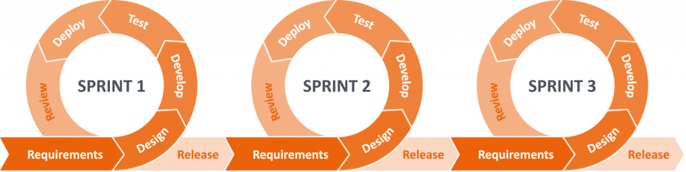
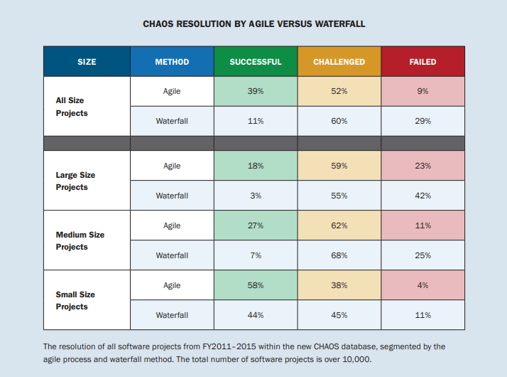
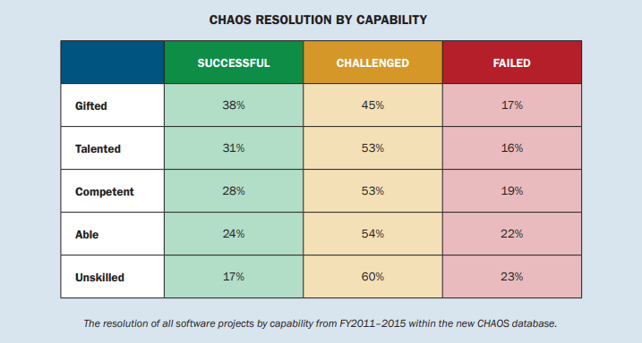

# What is the Agile Methodology?

Agile is an approach to software development that emphasizes the importance of taking incremental and iterative steps to create a software program. Each incremental cycle of a project is known as a "Sprint" and is carried out in a short-term period that usually ranges between 1 and 4 weeks. The Agile methodology prioritizes quick delivery, adapting to change, collaboration between developers and constant communication between the customer and the development team. Agile also reduces the reliance on top-down management and preset long-term plans.

The Agile methodology fosters collaborative teamwork by encouraging developers to break project silos and cooperate in each incremental development cycle. Additionally, the continuous feedback loop between the software developers and the customers allows the team to prioritize features that focus on customer needs and quickly shift focus to other features when the requirements change.

On the other hand, traditional software development methodologies like the Waterfall methodology generally progress linearly through the planning, designing, implementation, verification and maintenance stages. Each phase must be completed before moving to the next one. This linear approach to software development often leads to lower success rates, higher development costs and a software product that may not meet the customer's fluctuating needs.  

## History of Agile

In the spring of 2000, a group of 17 software developers met in Oregon to devise new ways to speed up software development times in order to bring new software to market faster. They identified two key opportunities that could potentially help them achieve their goal:

1. Shortening the time between receiving the user requirements for a software project and delivering a minimum viable product.
2. Getting continuous feedback from users regarding new software and continuing to iterate on it accordingly.

Less than a year after that Oregon meeting, the same group of 17 developers met again in Snowbird, Utah. During a three-day time period, the team created the “Manifesto for Agile Software Development” (commonly known as the Agile Manifesto) that laid out the 4 key pillars of the Agile methodology.
## What are the 4 pillars of Agile?

As outlined in the Agile Manifesto, there are four main pillars of Agile software development:

- **Individuals over processes and tools:** Agile prioritizes team collaboration over working independently or following predefined rules and processes.

- **Working software over comprehensive documentation:** Creating functional software iteratively is the main goal of Agile. Documentation, while useful, is not as crucial as developing working software.

- **Customer collaboration over contract negotiation:** Agile software is guided by customer needs and feedback. Therefore, collaboration between the customer and the software development team is significantly more important than the contract negotiation process.

- **Responding to change over following a plan:** One of Agile's main strengths is its flexibility and ability to adapt to constantly changing requirements. As such, Agile allows teams to quickly shift strategies and workflows without derailing or restarting an entire project.

## What are the 12 principles of Agile?

The Agile Manifesto outlined 12 principles that should always guide a team's decisions and software development process:

1. Our highest priority is to satisfy the customer through early and continuous delivery of valuable software (or whatever else you deliver).
2. Welcome changing requirements, even late in development. Agile processes harness change for the customer’s competitive advantage.
3. Deliver projects frequently, from a couple of weeks to a couple of months, with a preference for the shorter timescale.
4. Coordinating team members must work together daily throughout the project.
5. Build projects around motivated individuals. Give them the environment and support they need and trust them to get the job done.
6. Face-to-face conversation is the most efficient and effective method of conveying information to and within different teams.
7. The final product is the primary measure of progress.
8. Agile processes promote sustainable development. All stakeholders should be able to maintain a constant pace indefinitely.
9. Continuous attention to technical excellence and good design enhances agility.
10. Simplicity — the art of maximizing the amount of work not done — is essential.
11. The best architectures, requirements, and designs emerge from self-organizing teams.
12. At regular intervals, the team reflects on how to become more effective, then tunes and adjusts its behavior accordingly.

## What are the key components of Agile?

The Agile methodology makes use of several key components listed below:

- **User stories:** a user story is a high-level description of a work request or program feature written from the customer's perspective. A user story should clearly outline the customer's role, their goal and the benefit obtained by achieving the goal. A common format for user stories is: "As a &lt;type of user&gt; I want to &lt;perform some task&gt; so that I can &lt;achieve some goal&gt;." e.g., "As a manager, I want to be able to view a report of all expenses in the past quarter so that I can budget for the upcoming quarter."

- **Epics:** An epic is a collection of related user stories that create a large story when combined.

- **Task/Spike:** A single unit of work broken down from a user story. Tasks or spikes are a subsection of user story that help developers identify the steps needed in order to implement a user story.

- **Sprint/Iteration:** Sprints or iterations are a short designated period of time, usually taking between one to four weeks to complete, during which a team works on a determined set of user stories. The iterative nature of Agile means that the developers will need to continuously repeat sprints until the product is ready. The length of a sprint can vary from one sprint to another depending on the workload and the needs of the customers. At the end of each sprint, the team should reconvene assess the software product to identify the parts that are fully functional and the parts that still require more work, make adjustments, and begin another sprint to improve the product. 

- **Agile Board:** An Agile Board helps the development team keep track of the progress of their project as a whole as well as each individual sprint or user story. An Agile Board contains the following containers:
	- **Product Backlog:** contains the user stories that are not part of the current sprint or iteration.
	- **Sprint Backlog:** contains the user stories that are part of the current sprint or iteration.
	- **Icebox:** contains frozen user stories that may or may not be tackled in the future. User stories should only be moved to the Icebox container if the team assessed them and decided to put them on freeze.
	- **Todo:** contains the tasks associated with the user stories in the current sprint that have not been started yet.
	- **In Progress:** contains the tasks associated with the user stories in the current sprint that are currently being worked on.
	- **Awaiting Review:** contains the tasks associated with the user stories in the current sprint that are completed but have yet to be reviewed.
	- **Done:** contains the completed tasks associated with the user stories in the current sprint.

- **Sync Points/Milestones:** Agile teams need to come together regularly to plan their releases. Using sync points or milestones, the team can keep track of the progress on a group of user stories. Sync points/Milestones can be set for quarterly releases of a software product. At each milestone, the team should reconvene to assess the progress of the project and make adjustments as needed before moving on to the next set of iterations. Sync points are also an opportunity for bigger picture assessments, evaluations and feedback. Short sprints or iterations can have a negative effect on the overall design of your software product. However, sync points allow the team to asses how the goals in the previous iterations were accomplished and potentially reorganize or refactor the design of their software to improve clarity or overall functionality. It is important to distinguish between the iteration planning sessions that focus on short-range goals and these sync points that are geared towards mid or long-range goals and plans.

## What is the Agile workflow for software development?

In order to use Agile project management, we recommend using the following workflow to organize your project:

1. Start by meeting with the customers or stakeholders of your project and collect user stories written in simple terms and from their perspective. Make sure not to include implementation details in your user stories. 
2. Organize your user stories into epics by finding stories that connect to one another and make up a cohesive epic that revolves around a single topic.
3. Create your Agile Board using a project management tool.
4. Assess your user stories and identify the ones that have a higher priority and should be tackled in this iteration. If you encounter any user stories that you want to freeze, make sure to move them to the Icebox container.
5. Split each user story into multiple tasks that include more implementation and technical details. The tasks will then be tackled by the development team. Ensure that each task gradually moves from the containers in the following order: Todo &rarr; In Progress &rarr; Awaiting Review &rarr; Done.
6. At the end of the iteration, the team should reconvene and assess their progress and make modifications as needed based on the customer feedback. Keep an open mind to any changing requirements that may arise.
7. Once the iteration is complete, the team can move on to next iteration by repeating steps 4-6.
8. The team should then set sync points or milestones to assess the project's progress and evaluate the strategies used and the mid and long-term project goals.
9. The team will then continue to iteratively build the software product using sprints until a minimum viable product that can be deployed is created. 

_Image retrieved from [softwaresolved.com](https://www.softwaresolved.com/our-methodology)_

We will provide more concrete details on how you can use project management tools like GitHub Project and Microsoft Planner to implement the proposed workflow in the coming sections. 
## How to prioritize user stories in Agile? 

After collecting user stories from the customers or stakeholders, the software development team will need to rank these user stories by priority to ensure that the most crucial user stories are tackled first. There are several techniques that you can use to prioritize user stories. We recommend using the **MoSCoW** model, credited to the data scientist Dai Clegg. The MoSCoW model has roots in the Agile methodology and takes its name from the letters that make up its criteria: **M**ust Have, **S**hould Have, **C**ould Have and **W**on’t Have.

**Must Have:** User stories in this category are considered high priority and essential to a successful release or it would be unsafe to release the product without them. If the team can think of workaround to release the product without a "Must Have" user story, then it should be downgraded to "Should Have" or "Could Have".

**Should Have:** User stories in this category are important, but not essential to the proper functioning of the software product. Leaving them out may impact the quality or functionality of your software, but it will not affect the minimum viability of your product. 

**Could Have:** This category can be considered a wish-list. "Could Have" user stories should be the first ones to be ignored or rejected in case of limited time or resources

**Won't Have:** This category contains user stories that the team has agreed will not make it into the product. If you think a "Won't Have" user story may be reconsidered in the future, you may place in the Icebox container of your Agile Board.

It is imperative that the team does not spend too much time or effort prioritizing user stories. The only real measure of progress in Agile development is functioning software (even if it is incomplete). Spending too much time on estimates for your user stories will reduce the amount of time and resources spent on developing the software product, and thus move your methodology further away from the real principles of Agile.
## How does Agile compare to traditional software development methodologies (Waterfall)?

The Standish Group Chaos Study reports on several aspects of software development including a comparison between the tradition Waterfall software development methodology and Agile. The study was conducted on a corpus that included more than 10,000 software projects. The report found that Agile projects have almost four times the success rate as Waterfall projects. Furthermore, projects using the Waterfall methodology have three times the failure rate of their Agile counterparts. The results also clearly indicate that Waterfall projects do not scale well, whereas Agile projects scale much better. 

_Image retrieved from the [2015 Standish Group Chaos Report](https://www.standishgroup.com/sample_research_files/CHAOSReport2015-Final.pdf)_

The table above shows a detailed comparison between Agile and Waterfall projects based on size. The Standish Group classifies a project as successful, challenged or failed according to the following definitions:

- **Successful:** A project is considered successful if it meets all three of the triple constraints: schedule, cost, and scope.

- **Challenged:** A project is considered challenged if meets two out of three constraints, e.g., delivered on time and on budget but not with the desired scope.

- **Failed:** A failed project is one that is canceled before it is completed, or completed but not used.

The results in the table above indicate that projects of all sizes benefit from adopting the Agile methodology given that Agile projects of all size have higher success rates and lower challenge and failure compared to Waterfall projects of similar sizes. 

_Image retrieved from the [2015 Standish Group Chaos Report](https://www.standishgroup.com/sample_research_files/CHAOSReport2015-Final.pdf)_

The Standish Group Chaos Study also highlights the importance of mastering the principles of Agile. The report found that the success rate of Agile projects increased as the level of competence of the development team in Agile increased. Similarly, teams that are more skilled in Agile are less usually less challenged and face less failure rates during the development process. Consequently, we believe that learning and mastering the Agile development process will greatly benefit software projects of all sizes and pay dividends for the development team in the long run.